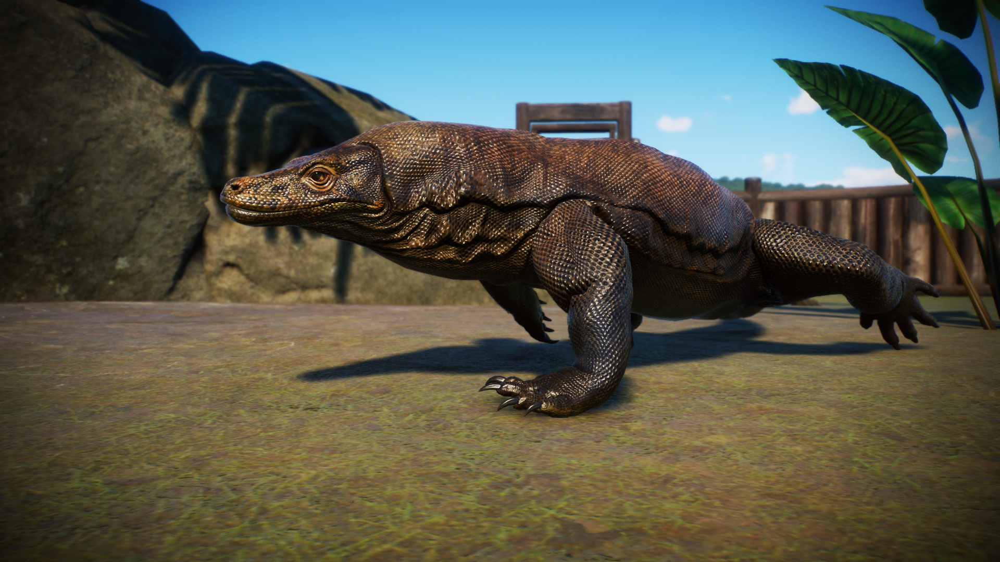

  

<h3 align="center">Improved-Komodo-Draogn</h3>

   
  

---

 My attempt at improving the Komodo Dragon, the largest lizard to walk on our planet today.
      

## :memo: Table of Contents
- [About](#about)
- [Getting Started](#getting_started)
- [Media](#media)
- [Project Structure](#project_structure)
- [Created Using](#created_using)
- [Authors](#authors)
- [Acknowledgments](#acknowledgement)

## :monocle_face: About 
My attempt at improving the Komodo Dragon, the largest lizard to walk on our planet today. It includes edited models and textures for the Komodo Dragon. I made the face a little browner in color to better match the body texture, as well as adjusting the shape of the body to try to make it look more realistic. Also available on [Nexus Mods](https://www.nexusmods.com/planetzoo/mods/1187).

## :checkered_flag: Getting Started 
These instructions will get the mod set up in your game, for either in-game use or for making edits/contributions.

### Installing
Extract the contents of the .zip file to win64 within the game directory. As an alternative, the .zip is packaged for easy installation using [Vortex](https://www.nexusmods.com/about/vortex/)

### Contributing
Right click on .\tools\download-tools.ps1, and click "run with PowerShell" to install the necessary tools for editing.
Pull requests are welcome. For major changes, please open an issue first to discuss what you would like to change.
Additional screenshots for the media category are accepted, but please format them as .jpg images.

**Note:** The included ovl may break with game updates. If necessary, use [Cobra Tools](https://github.com/OpenNaja/cobra-tools) to unpack the vanilla .ovl file, export the .blend file to an .ms2 model, and reinject it with the Cobra Tools into an .ovl file.

## :framed_picture: Media 

## :file_folder: Project Structure 
- **blend:** .blend model files. Use with Blender. Inside, is a folder for textures.
- **docs:** Documentation and reference material.
- **media:** Pictures and other media to show the mod.
- **ovl:** .ovl archives. These are what is actually loaded in the game.
- **tools:** All tools used to create and edit the mod.

## :pick: Created Using 
- [Cobra Tools](https://github.com/OpenNaja/cobra-tools) - Editing .ovl & .ms2 files.
- [Blender](https://www.blender.org/) - Models
- [GIMP](https://www.gimp.org/) - Textures

## :writing_hand: Authors 
- [@albin-xavier](https://github.com/Albin-Xavier) - Idea & Initial work

See also the list of [contributors](https://github.com/Albin-Xavier/Template-Repo-Cobra/contributors) who participated in this project.

## :tada: Acknowledgements 
- [kylelobo's Documentation-Compendium](https://github.com/kylelobo/The-Documentation-Compendium), which much of the documentation was based off of, including this README.

## :spiral_notepad: License
[MIT](https://choosealicense.com/licenses/mit/) for the PowerShell scripting.\
[Creative Commons Attribution 4.0](https://choosealicense.com/licenses/cc-by-4.0/) for everything else.
